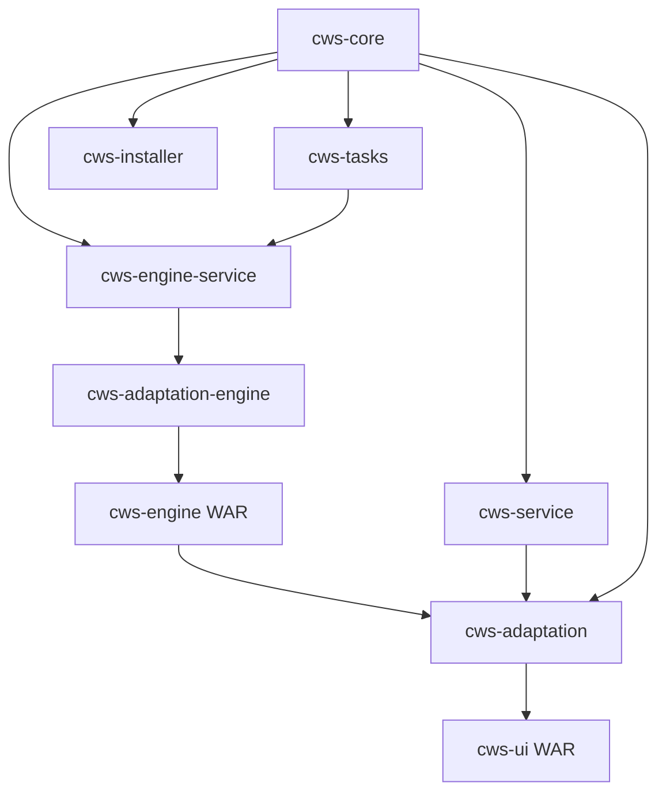

# Architecture

CWS is a layered, service-oriented, multi-module Maven project built on the
Camunda BPMN engine.

## Key technologies

| Technology | Version | Role |
| --- | --- | --- |
| Java | 17 | Runtime (enforced by Maven) |
| Spring Framework | 7.0.x | Dependency injection, web, transactions |
| Camunda BPM | 7.24.x (Enterprise) | Workflow engine and BPMN execution |
| Apache Artemis | — | Message queue for external-task communication |
| MyBatis | — | Database ORM and query mapping |
| Apache Tomcat | 11.x | Application server |
| Elasticsearch | 8.12+ | Log and history aggregation |
| MariaDB / MySQL | — | Relational datastore |

See [Requirements & Compatibility](../install/requirements.md) for exact
versions.

## Modules

CWS is composed of these Maven modules:

| Module | Responsibility |
| --- | --- |
| **cws-core** | Foundation: configuration, database services, logging, security. |
| **cws-tasks** | BPMN task implementations (email, command line, REST, file operations, sleep). |
| **cws-service** | Business logic: process initiators, scheduling, REST APIs. |
| **cws-engine-service** | Engine-specific services and external-task handling. |
| **cws-engine** *(WAR)* | Camunda engine integration. |
| **cws-adaptation-engine** | Adaptation hooks for the engine layer. |
| **cws-adaptation** | Project-specific customizations. |
| **cws-ui** *(WAR)* | Web-based user interface (the console). |
| **cws-installer** | Installation and configuration utilities. |
| **cws-test** | Integration and system testing framework. |

## Module dependencies

## Layered design

- **Foundation (`cws-core`)** provides cross-cutting services used everywhere:
  configuration, the centralized `DbService` for database access, logging, and
  security filters (LDAP, Camunda, and general web security).
- **Task and service layers (`cws-tasks`, `cws-service`, `cws-engine-service`)**
  implement workflow behavior, the external-task engine, scheduling, and the
  REST API.
- **Engine integration (`cws-engine`, `cws-adaptation-engine`)** packages the
  Camunda engine as a deployable WAR with adaptation hooks.
- **Presentation and customization (`cws-ui`, `cws-adaptation`)** deliver the
  web console and the project-specific adaptation layer.

## External task processing

Work is distributed via **Apache Artemis (ActiveMQ)** message queuing. Workers
can run as separate JVM processes, and the external task service in
`cws-engine-service` distributes tasks to them. Workers support multiple run
modes (for example: run everything, run models only, or run external tasks
only).

## Extending CWS

Rather than fork the codebase, extend CWS through the adaptation layer:

- [Adapting CWS for a Mission](adaptation.md)
- [Writing Custom Tasks](custom-tasks.md) (extend the `CwsTask` base class)
- [Developing Custom Initiators](custom-initiators.md)
- [Custom Security Scheme Plugins](security-plugin.md)
