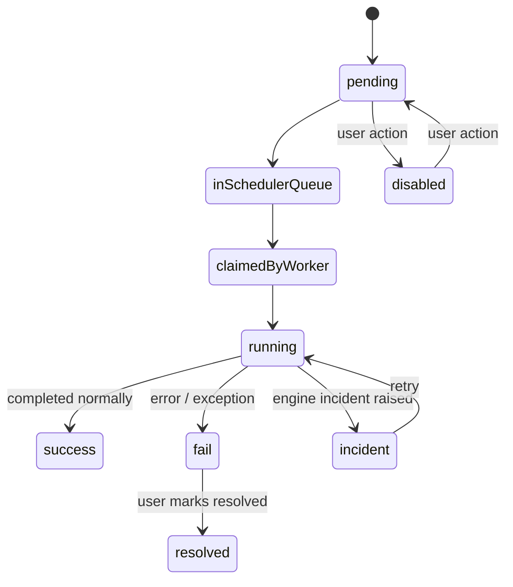

# Process Instance Lifecycle

When a process is started in CWS — whether manually, via an initiator, or
through the REST API — it goes through a defined lifecycle.

## Status transitions

## Status descriptions

| Status | Meaning |
| --- | --- |
| **pending** | Queued and waiting for a worker to pick it up. |
| **inSchedulerQueue** | Accepted by the scheduler, waiting for assignment. |
| **claimedByWorker** | A worker has claimed the instance. |
| **running** | Actively executing on a worker. |
| **success** | Completed normally (reached an end event). |
| **fail** | An error prevented successful completion. |
| **incident** | The engine raised one or more incidents (retryable). |
| **disabled** | User manually disabled the pending instance. |
| **resolved** | A failed instance marked as acknowledged by the user. |

## Where to see status

- **[Deployments page](../user-guide/console/deployments.md)** — color-coded
  bars showing the aggregate status distribution per process.
- **[Processes page](../user-guide/console/processes.md)** — individual
  instances with their current status and available actions.
- **[REST API](../user-guide/launching/rest.md#monitoring-instance-status)** —
  poll the `/process-instance/<uuid>/status` endpoint.

## What happens on failure

When a process instance ends in `fail`:

- The failure is visible on the Processes page.
- The [Logs page](../user-guide/console/logs.md) shows the error context.
- You can **mark it as resolved** (acknowledged, counted as completed in
  statistics) or investigate and retry if the process supports it.

## Incidents

An **incident** is a retryable failure raised by the Camunda engine (e.g. a
transient error, a timed-out external task). CWS displays incidents in pink on
the Deployments page. You can **retry** incidents from the Processes page, which
restarts execution from the last successful
[commit point](https://docs.camunda.org/manual/7.24/user-guide/process-engine/transactions-in-processes/#asynchronous-continuations).
